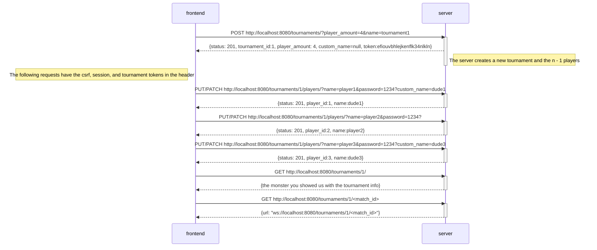

```mermaid
	sequenceDiagram
		participant frontend
		participant server

		frontend->>server: POST http://localhost:8080/tournaments/?player_amount=4&name=tournament1
		activate server
		server-->>frontend: {status: 201, tournament_id:1, player_amount: 4, custom_name=null, token:efiouvbhlejkenflk34nlkln}
		Note right of server: The server creates a new tournament and the n - 1 players
		deactivate server

		Note left of frontend: The following requests have the csrf, session, and tournament tokens in the header
		frontend->>server: PUT/PATCH http://localhost:8080/tournaments/1/players/?name=player1&password=1234?custom_name=dude1
		activate server
		server-->>frontend: {status: 201, player_id:1, name:dude1}
		deactivate server

		frontend->>server: PUT/PATCH http://localhost:8080/tournaments/1/players/?name=player2&password=1234?
		activate server
		server-->>frontend: {status: 201, player_id:2, name:player2}
		deactivate server

		frontend->>server: PUT/PATCH http://localhost:8080/tournaments/1/players/?name=player3&password=1234?custom_name=dude3
		activate server
		server-->>frontend: {status: 201, player_id:3, name:dude3}
		deactivate server

		frontend->>server: GET http://localhost:8080/tournaments/1/
		activate server
		server-->>frontend: {the monster you showed us with the tournament info}
		deactivate server

		frontend->>server: GET http://localhost:8080/tournaments/1/<match_id>
		activate server
		server-->>frontend: {url: "ws://localhost:8080/tournaments/1/<match_id>"}
		deactivate server

```